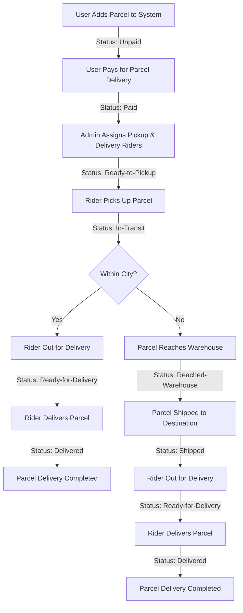

#  Shift Resources


Welcome to ** Shift Resources**!
A comprehensive platform designed to streamline parcel management and delivery operations for users, agents, and administrators. This project provides tools, guides, and assets to manage, track, and deliver parcels efficiently across cities and districts.

---

## 📖 Description

**Zap Shift Resources** is a full-featured parcel management system that allows users to book, track, and pay for parcel deliveries seamlessly. Admins can manage deliveries, assign agents, and monitor operational workflows, while agents/riders can collect, transport, and deliver parcels securely.
The system ensures **real-time tracking, automated pricing, role-based access, and OTP-secured delivery** across 64 districts in Bangladesh. It's built to optimize operations, improve user experience, and maintain transparency in logistics management.

---

## 🗂️ Key Features

* Automated Pricing & Tracking
* Role-Based Access Control
* OTP-Secured Delivery
* Nationwide Coverage (64 districts)
* Transparent Commission Structure
* Parcel Management (Add, Update, Track)
* Responsive & User-Friendly Interface
* Admin Analytics Dashboard
* Real-Time Notifications
* Search, Filter & Sort Parcels
* Export Reports (CSV/PDF)

---

## 💻 Technology Stack / Used Languages

**Frontend:** HTML5, CSS3, JavaScript, React.js, Tailwind CSS
**Backend:** Node.js, Express.js
**Database:** MongoDB / Firebase
**Authentication & Security:** JWT, OTP verification
**Libraries & Tools:** Axios, React Router, NodeMailer, Mermaid.js
**Deployment:** Vercel / Netlify for frontend, Heroku / Render for backend

---

## ⚙️ Installation / Setup

1. **Clone the repository**

```bash
git clone https://github.com/Monir312/shift-delivery-project-client.git
cd shift-delivery-project-client
```

2. **Install dependencies**

```bash
npm install
```

3. **Set environment variables**
   Create a `.env` file and add:

```env
REACT_APP_API_URL=your_backend_api_url
REACT_APP_FIREBASE_API_KEY=your_firebase_api_key
```

4. **Run the application**

```bash
npm start
```

Open your browser and navigate to `http://localhost:3000`

---

## 🚀 How It Works

1. **User Side:**

   * Register/Login
   * Add parcel details
   * Pay delivery charges
   * Track parcel status in real-time

2. **Admin Side:**

   * Login via secure credentials
   * Assign pickup and delivery agents
   * Monitor parcel movements
   * Manage warehouses and operational workflows

3. **Agent/Rider Side:**

   * View assigned parcels
   * Collect parcels and update status
   * Deliver parcels using OTP confirmation
   * Track commission per delivery

---

## 📊 System Overview Table

| Role            | Key Responsibilities                                                                      | Earnings/Benefits                              |
| --------------- | ----------------------------------------------------------------------------------------- | ---------------------------------------------- |
| **User**        | - Book parcels<br>- Pay charges<br>- Track status<br>- Review service                     | - Real-time tracking<br>- Feedback opportunity |
| **Admin**       | - Assign agents<br>- Manage routing<br>- Oversee warehouses<br>- Monitor operations       | - System control<br>- Operational oversight    |
| **Agent/Rider** | - Collect/Deliver parcels<br>- Update status<br>- OTP confirmation<br>- Warehouse handoff | - ৳20 per delivery                             |

---

## 🛒 Pricing Structure

| Parcel Type      | Weight    | Within City | Outside City/District |
| ---------------- | --------- | ----------- | --------------------- |
| **Document**     | Any       | ৳60         | ৳80                   |
| **Non-Document** | Up to 3kg | ৳110        | ৳150                  |
| **Non-Document** | >3kg      | +৳40/kg     | +৳40/kg +৳40 extra    |

---

## 🚚 Delivery Workflow



---

## 📷 Screenshots


---

## 🌐 Live Demo

Check out the live project: [Live Demo](https://zapshift.vercel.app)

---

## 📝 Usage

* Register as a **User**, **Admin**, or **Agent**.
* Add or assign parcels according to roles.
* Track parcel movements and update statuses in real-time.
* Generate reports and monitor delivery performance (Admin).
* Ensure OTP-based delivery confirmation (Agent/Rider).

---

## 🤝 Contribution

We welcome contributions! If you'd like to contribute:

1. Fork the repository
2. Create a new branch (`git checkout -b feature-name`)
3. Make your changes
4. Commit your changes (`git commit -m 'Add new feature'`)
5. Push to the branch (`git push origin feature-name`)
6. Create a Pull Request

---

## ❓ FAQ / Common Issues

**Q:** npm install gives errors
**A:** Delete `node_modules` and `package-lock.json` and run `npm install` again

**Q:** .env variables not working
**A:** Ensure `.env` is in the root folder and keys match the code references

**Q:** Connection issues with backend
**A:** Check `REACT_APP_API_URL` is correct and backend server is running

---

## 📄 License

This project is **MIT Licensed** – see the [LICENSE](LICENSE) file for details.

---

## 🙏 Acknowledgements

* React.js Documentation
* Tailwind CSS
* Node.js & Express.js Tutorials
* MongoDB Atlas Guides
* Mermaid.js for workflow diagrams

---

## 📞 Contact

**Md. Manirul Islam** – [GitHub](https://github.com/Monir312) | [Email](mailto:monir@example.com)

---

**Zap Shift Resources** – Making parcel delivery smarter, faster, and transparent.
